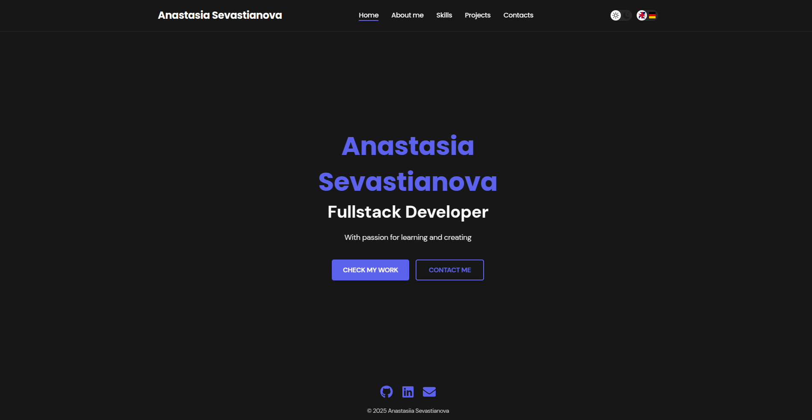

# Anastasia Sevastianova - Fullstack Developer Portfolio

Personal portfolio for a Fullstack Developer based in Germany. The site highlights selected frontend and fullstack projects with recruiter-friendly case studies, live demos, source code, contact options, and multilingual content.

## Live demo

[Open portfolio](https://portfolio-two-jade-83.vercel.app/)

## Recruiter links

- CV: [request by email](mailto:sevastyanova.anastasia1@gmail.com?subject=CV%20request%20-%20Fullstack%20Developer)
- LinkedIn: [Anastasia Sevastianova](https://www.linkedin.com/in/anastasia-sevastianova)
- GitHub: [@anastasia2022be1](https://github.com/anastasia2022be1)
- Email: [sevastyanova.anastasia1@gmail.com](mailto:sevastyanova.anastasia1@gmail.com)
- Location: Germany
- Work authorization: details available on request

## Featured projects

| Project | Type | Problem | Role | Links |
| --- | --- | --- | --- | --- |
| Enterprise Admin Dashboard | Frontend | Organizes KPIs, protected pages, navigation, and async states for an admin workflow. | Built the React/TypeScript dashboard architecture, Redux Toolkit state slices, protected routes, reusable UI, and responsive layouts. | [Live](https://enterprise-admin-dashboard.vercel.app/dashboard) / [Code](https://github.com/anastasia2022be1/enterprise-admin-dashboard) |
| Weather App | Frontend | Lets users check weather, forecast, local time, timezone, and units for any city. | Built the React UI, API integration, geolocation flow, timezone handling, responsive layout, and error feedback. | [Live](https://weather-app-with-openweather-api.netlify.app/) / [Code](https://github.com/anastasia2022be1/weather-app) |
| Nutrient App | Frontend | Helps users search foods, track nutrients, and plan meals with real nutrition data. | Built SPA routing, API data handling, local persistence, meal-planning screens, and responsive Bootstrap UI. | [Live](https://nutrient-app.onrender.com/) / [Code](https://github.com/anastasia2022be1/nutrient-counter) |
| Mehr Blog | Fullstack | Gives authors a publishing flow with auth, profile editing, image upload, and CRUD posts. | Built the React frontend, Express REST API, MongoDB model, JWT auth, Swagger docs, and cloud deployment setup. | [Live](https://mehr-blog-frontend.vercel.app/) / [Code](https://github.com/anastasia2022be1/mehr-blog) |
| Talki Chat App | Fullstack | Supports private and group real-time chats with auth, files, read receipts, and reactions. | Built the real-time messaging flow with Socket.IO, Node/Express API, MongoDB persistence, JWT auth, and uploads. | [Code](https://github.com/anastasia2022be1/chat-app) |
| Meal Plan Generator | Fullstack | Turns dietary preferences and restrictions into AI-supported meal plans with account and payment-ready flows. | Built the Next.js/TypeScript app structure, Prisma/PostgreSQL model, Clerk auth, Stripe-ready flow, React Query state, and OpenAI integration. | [Code](https://github.com/anastasia2022be1/meal-plan) |

## Tech stack

- Frontend: React, Vite, TypeScript, JavaScript, SCSS, Tailwind CSS, Bootstrap
- Backend: Node.js, Express, REST APIs
- Data: MongoDB, PostgreSQL, Prisma
- Auth and product flows: JWT, Clerk, Stripe-ready payments
- Integrations: OpenWeather API, GeoNames API, USDA FoodData API, OpenAI API, Socket.IO
- Tooling: ESLint, Vercel, Netlify, Render, GitHub
- UI states: responsive layout, dark mode, project filters, toast notifications
- i18n: react-i18next with English and German

## Pages

- `/` - Home with Fullstack Developer positioning and recruiter links
- `/about-me` - About me
- `/skills` - Skill set
- `/projects` - Project list with category filters
- `/projects/:id` - Project case study details
- `/contacts` - Contact form, CV request, LinkedIn, GitHub, email, location, and work authorization note

## Run locally

```bash
npm install
npm run dev
```

## Quality checks

```bash
npm run lint
npm run build
```

## Preview



## Notes

Additional setup notes for contact form, Gmail auto-reply, and GitHub profile polishing live in `docs/`.
